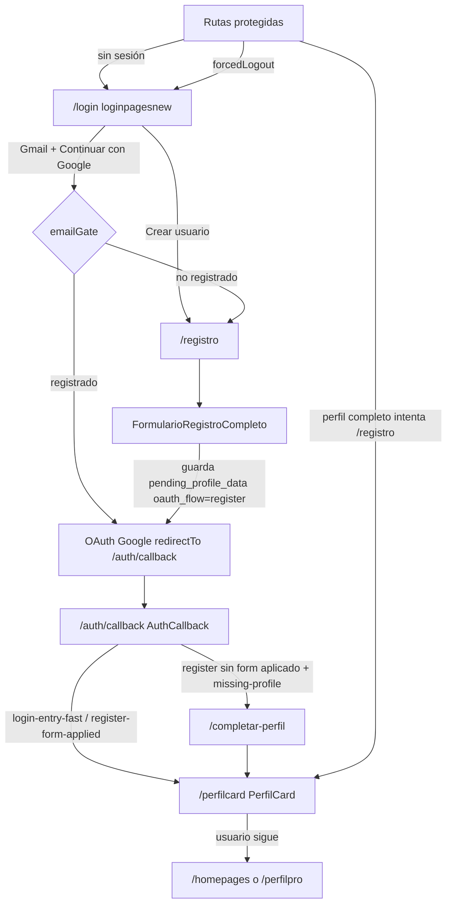

# Flujo completo del deploy (Zona Pro) — replicar IGUAL

**Fuente de verdad:** `producto-deploy/` (ZIP `deploy-6a7256d5ffd58e44433d5158`)  
**No usar** el flujo de enero (`_legacy_archivo`).  
**Constante canónica en bundle:** `UI = "/perfilcard"`

Cuando editemos `App.jsx`, auth, registro o PerfilCard en el fuente del PC, el comportamiento debe quedar **igual a este documento**.

---

## Diagrama

---

## 1) Login — `loginpagesnew.jsx` → chunk `loginpagesnew-*.js`

Ruta: `/login`

1. Usuario escribe Gmail.
2. **Continuar con Google**
   - Valida email (`@`).
   - `emailRegistrationGate` / RPC `fp_email_registro_estado` + tabla `usuarios`.
   - Si **no registrado** → navega a `/registro` con `{ email, reason, fromLoginGate: true }` (no OAuth).
   - Si **registrado** (o lookup incierto que permite seguir):
     - `sessionStorage.oauth_flow = "login"`
     - `sessionStorage.futpro:email_gate_ok = "1"`
     - `sessionStorage.oauth_email = email`
     - OAuth Google con `redirectTo = {origin}/auth/callback`
3. **Crear usuario** → `/registro` (`oauth_flow` register vía helper), sin saltar a home.
4. Si ya hay sesión válida, **login guard** redirige a `/perfilcard` (`fromLoginGuard`), no a home.

Métricas: `login_submit` → `login_email_gate` → `oauth_redirect_start`.

---

## 2) Registro — `RegistroEntryRoute` + `FormularioRegistroCompleto.jsx`

Rutas: `/registro` (y aliases que redirigen al form)

1. `RegistroEntryRoute` verifica sesión; si el gate pide redirect (ya logueado / no re-registro) → cumple redirect (suele ser `/perfilcard`).
2. Formulario guarda perfil pendiente:
   - `sessionStorage/localStorage.pending_profile_data`
   - `oauth_flow = "register"`
3. OAuth Google → `{origin}/auth/callback`
4. Si el email **ya está registrado** → vuelve a `/login` (`reason: already-registered`).
5. **No** navega directo a home ni omite callback.

---

## 3) AuthCallback — inlined en `index-zp-nomenu-*.js`

Rutas: `/auth/callback`, `/callback`

1. Restaura sesión Supabase / tokens.
2. Métricas: `callback_mount` → `callback_session_restored` → `callback_profile_ready` → `callback_navigation_target`.
3. Destino por defecto: **`/perfilcard`**
   - Login: `reason: "login-entry-fast"`, `fromAuthCallback: true`
   - Registro con form aplicado: `reason: "register-form-applied"`, `fromAuthCallback: true`
4. Caso especial registro: si `oauth_flow === "register"` y falta perfil/form → puede ir a `/completar-perfil` y luego el sistema empuja a card.
5. Texto UI: `"Entrando a PerfilCard..."`.
6. Cookie/dev override `futpro_dev_next` puede cambiar destino (solo debug); producción = perfilcard.

**Nunca** dejar el callback en `/login` ni mandar a `/home` como primer destino post-auth.

---

## 4) PerfilCard — OBLIGATORIO — inlined en `index-*.js`

Rutas:

| Ruta | Comportamiento |
|---|---|
| `/perfilcard` | Canónica |
| `/perfil-card` | Redirect → `/perfilcard` |

Al montar:

- Evento `perfilcard_mounted` (métricas login→callback→perfilcard).
- Cache `futpro:perfilcard:cache:v1`.
- Carga card / convocatorias / realtime.
- `profileCompletionGate`: aunque falte card (`missing-card`) o recover (`recover-pending`), la ruta sigue siendo **`/perfilcard`**.

Salidas del usuario (después de pasar por aquí):

- Continuar → `/homepages` (`fromPerfilCard`)
- Ver perfil → `/perfilpro` (`fromPerfilCard`)

---

## 5) Guards globales (App / ProtectedRoute) — inlined

Replicar igual en `App.jsx`:

| Condición | Acción |
|---|---|
| `forcedLogout` y no está en login/callback | → `/login` |
| Ruta protegida sin `hasSessionHint` | → `/login` |
| Cuenta `inactive` | → `/login` |
| Perfil ya completo y entra a `/registro` o `/completar-perfil` | → `/perfilcard` (`no-reregister` / `profile-complete`) |
| Sesión + visita `/login` | gate → `/perfilcard` |

`/perfilcard` y `/perfil-card` se tratan como rutas de card (no bloquear como “falta sesión” si hay hint de perfil).

---

## 6) Archivos a tocar para que quede IGUAL

| Pieza deploy | Fuente PC esperado |
|---|---|
| Router + guards + AuthCallback + PerfilCard + PerfilPro + Home | `App.jsx` + páginas inlined en entry |
| Login | `loginpagesnew.jsx` |
| Registro | `RegistroEntryRoute.jsx` + `FormularioRegistroCompleto.jsx` |
| Backend email gate / usuarios | Supabase `usuarios`, RPC `fp_email_registro_estado`, functions |

Checklist de paridad:

- [ ] Post-login land = `/perfilcard`
- [ ] Post-registro land = `/perfilcard` (vía callback)
- [ ] `/perfil-card` → `/perfilcard`
- [ ] No ir a `/home` antes de PerfilCard
- [ ] `oauth_flow` login vs register
- [ ] `pending_profile_data` en registro
- [ ] `redirectTo` OAuth = `/auth/callback`
- [ ] Métricas `perfilcard_mounted`

---

## 7) Qué NO replicar (rompe el producto)

- Flujo enero: `LoginPage.jsx` / Instagram / `navigate('/home')` post-login.
- Omitir AuthCallback.
- Tratar PerfilCard como opcional.
- Usar solo chunks lazy e ignorar el entry `index-zp-nomenu-*.js`.

---

## Referencias

- Inventario: `auditoria/CONTEXTO_DEPLOY_COMPLETO.md`
- JSON: `auditoria/CONTEXTO_DEPLOY_A_JSX.json` → `auth_flow_mandatory`, `inlined_in_index_bundle`
- App en vivo: http://127.0.0.1:4173/login → (auth) → `/perfilcard`
